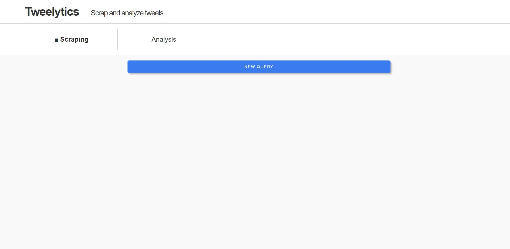
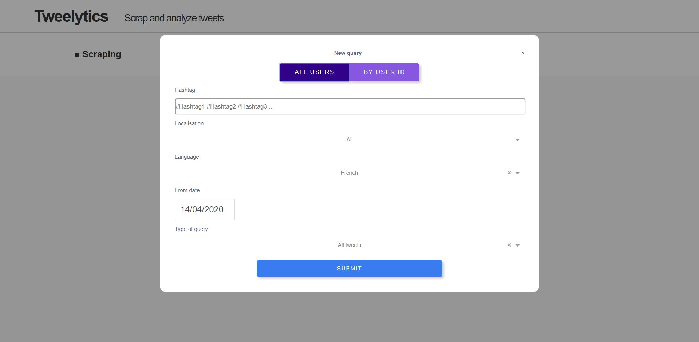
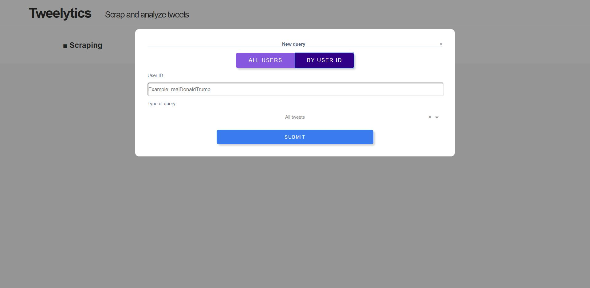
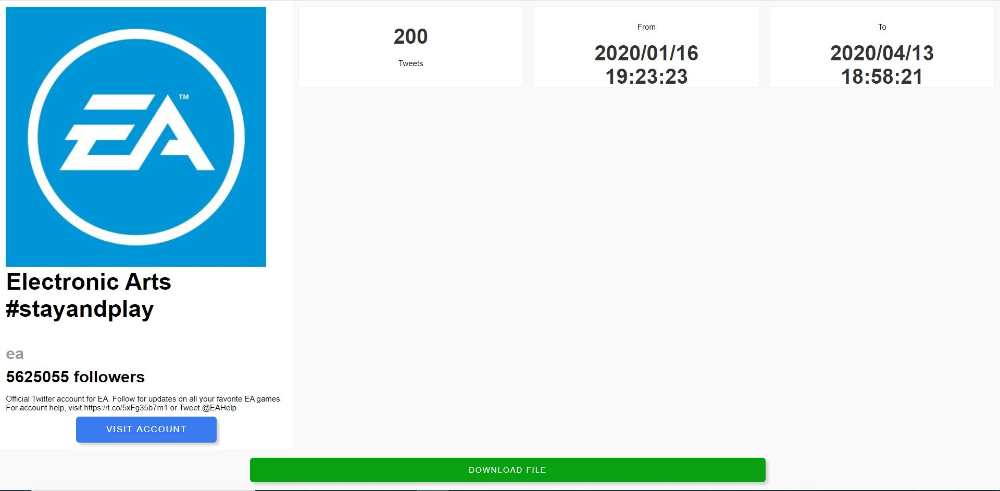
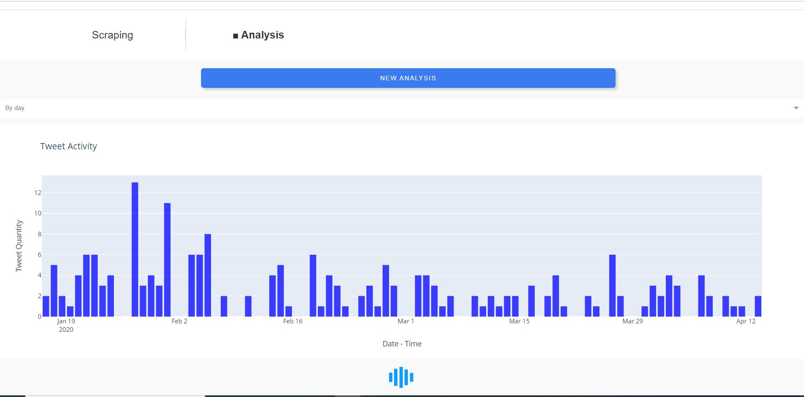

# Tweelytics

This app is based on the [Tweepy](https://www.tweepy.org/) and the [Twython](https://twython.readthedocs.io/) APIs in order to scrap tweets whether by a list of hashtags or by user.

The second tab of this app gives the possibility to visualize the tweets activity and the results of topic modeling on the scraped tweets during this scraping period.

## Getting Started

### Running the app locally

First create a virtual environment with conda or venv inside a temp folder, then activate it.

```
virtualenv venv

# Windows
venv\Scripts\activate
# Or Linux
source venv/bin/activate

```

Clone the git repo, then install the requirements with pip

```

git clone https://github.com/UnessElmar/Tweelytics.git
cd tweelytics_app
pip install -r requirements.txt

```

To run the app, please create a Tweepy developer account (link is in the `About the App` section). There is an example of how the bash script should look like in the `secrets.example.env` file. Be sure to create a new file named `.env` and put your credentials in the file. Therefore, your credentials will not get pushed to github as the `.env` file is in the `.gitignore`.

Run the app

```
python index.py
```

## About the App

This app uses Tweepy and Twython APIs in order to scrap tweets. This is a [tutorial](http://www.compjour.org/tutorials/getting-started-with-tweepy/) of how to get the access tokens.

## Built With

- [Dash](https://dash.plot.ly/) - Main server and interactive components
- [Plotly Python](https://plot.ly/python/) - Used to create the interactive plots

## Screenshots

The following are screenshots for the app in this repo:










